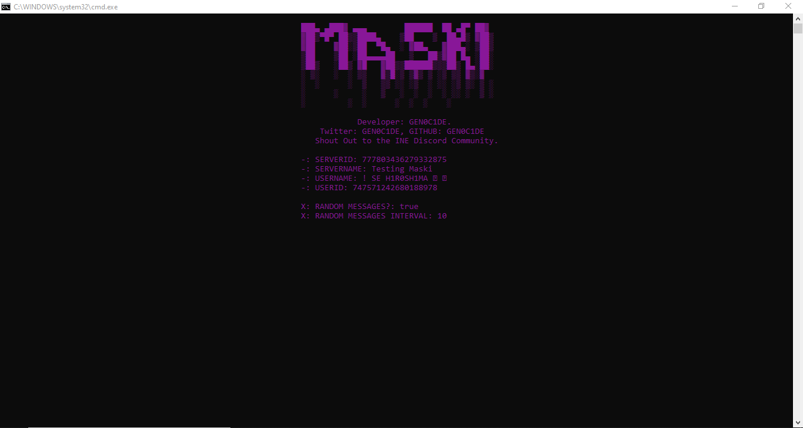

# MASKI
For Discord Packing, brought to you by the INE Discord Community.

# SETTINGS
SERVER_ID: THE ID OF THE SERVER FROM THE DEVELOPER MODE OF DISCORD.
STATUS_TYPES: STREAMING, WATCHING, LISTENING, PLAYING
USER_INTERVAL: 10 SECONDS (DEFAULT)
USER_TOKEN: USER AUTHORIZATION TOKEN FOR THE BOT TO LOGIN TO.

# REQUIREMENTS
X: Install Node.js.
1. Run the Install.bat file after downloading Node.js.
2. Run Run.bat to start the program.
3. The rest is in your hands.

# LIABILITY
- Using this application could result in the termination of your account, and for which I do not take any responsibility in you being disabled. Use this tool at your own risk. This tool was made for educational purposes. Use the tool wisely.
